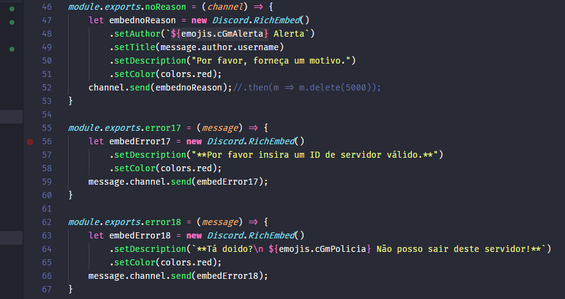
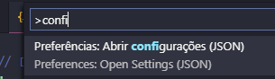

# Visual Studio Code

Atualmente estou utilizando bastante o **Visual Studio
Code** e se você ainda não teve a oportunidade de testar recomendo muito tirar um tempo pra isso. Eu sou sujeito a dizer pois já passei pelo Sublime Text, Atom, Vim, NetBeans, Notepad++ e o velho e bom bloco de notas e dentre eles o Visual Studio Code foi o que me atendeu melhor até agora. 🖖



###### Uma parte do código meu de bot para o Discord.

O que eu mais defendo no VSCode é a simplicidade e uma interface simples, mas completa sem perder funcionalidades de IDE como debug integrado com breakpoints, integração nativa com Git e autocomplete muito rápido.

Além disso se você segue padrões de código e instala uma biblioteca como ESLint (que conheci recentemente) vai entender que no VSCode simplesmente as coisas são bem mais rápidas, fora o terminal integrado que também ajuda muito principalmente quem programa em notebook que é o meu caso.

Para acessar o terminal no Linux e Windows basta apertar `CTRL+'`ou `CMD+'` no Mac, mas esses atalhos podem ser personalisados de acordo com as suas preferências.

> ## Algumas configurações

Recomendo algumas configurações para facilitar a legibilidade e edição do código. Para aplicar essas configurações você precisa acessar suas preferências, no Linux e Windows o atalho é `CTRL+Shift+P`, no Mac o atalho é `CMD+Shift+P` e digite configu e irá aparecer esta tela:


Clique em Preferências: Abrir configurações (JSON) e irá abrir o arquivo `settings.json` e nele utilizo essas configurações:

```js
{
    "workbench.colorTheme": "Dracula",
    "workbench.iconTheme": "material-icon-theme",
    // Terminal bash personalizado Windows
    "terminal.integrated.shell.windows": "C:\\Program Files\\Git\\bin\\bash.exe",

    // Desativando o minimap
    "editor.minimap.enabled": false,
    "window.zoomLevel": 0,
    "material-icon-theme.activeIconPack": "react",
    "explorer.confirmDragAndDrop": false,
    "explorer.confirmDelete": false,
    "editor.renderWhitespace": "none",
    "editor.renderControlCharacters": true,
    "editor.renderFinalNewline": true,
    "editor.renderIndentGuides": true,
    // Configuração da fonte
    "editor.fontSize": 14,
    "editor.lineHeight": 22,
    // Tamanho da fonte no terminal
    "terminal.integrated.fontSize": 14,
    "editor.fontFamily": "'Fira Code'",
    "editor.fontLigatures": true,
    "terminal.integrated.rendererType": "dom",
    "files.autoSave": "off",
    // Configurações do ESLINT
    "eslint.autoFixOnSave": true,
    "eslint.validate": [
        {
            "language": "javascript",
            "autoFix": true
        },
        {
            "language": "javascriptreact",
            "autoFix": true
        },
        {
            "language": "typescript",
            "autoFix": true
        },
        {
            "language": "typescriptreact",
            "autoFix": true
        }
    ],
    // Bug da LF e CRLF
    "files.eol": "\n",
    // 4 espaços sempre e desde sempre >)
    "editor.tabSize": 4,
    "editor.formatOnSave": true,
    "editor.rulers": [100, 120],
    "emmet.syntaxProfiles": {
        "javascript": "jsx"
    },
    // Formatando o React
    "emmet.includeLanguages": {
        "javascript": "javascriptreact",
        "nunjucks": "htmlt"
    },
    // Para de importar automaticamente os imports
    "javascript.updateImportsOnFileMove.enabled": "never",
    // Árvore de diretórios
    "breadcrumbs.enabled": true,
    // Desabilitar as documentações
    "editor.parameterHints.enabled": false,
    // Integração do Pretiter com o ESLint
    "prettier.eslintIntegration": true,
    // Forçando o espaçamento em 4
    "prettier.tabWidth": 4,
    "[jsonc]": {
        "editor.defaultFormatter": "esbenp.prettier-vscode"
    },
    "[json]": {
        "editor.defaultFormatter": "esbenp.prettier-vscode"
    },
    "[html]": {
        "editor.defaultFormatter": "esbenp.prettier-vscode"
    },
    "[javascript]": {
        "editor.defaultFormatter": "esbenp.prettier-vscode"
    },
    "gitlens.defaultDateShortFormat": "DD, MM, YYYY",
    "liveServer.settings.donotShowInfoMsg": true
}
```

> ## Plugins

Existe uma infinidade de plugins que você pode personalizar da forma que você desejar,
irei listar os que utilizo ultimamente.

-   [Dracula Official](https://marketplace.visualstudio.com/items?itemName=dracula-theme.theme-dracula) - Tema que estou utilizando bastante ultimamente.
-   [Material Icon Theme](https://github.com/PKief/vscode-material-icon-theme) - Tema de ícones.
-   [Discord Presence](https://marketplace.visualstudio.com/items?itemName=icrawl.discord-vscode) - Plugin para mostrar nos status do Discord.
-   [ESLint](https://marketplace.visualstudio.com/items?itemName=dbaeumer.vscode-eslint) - Plugin utilizado para padronizar código entre desenvolvedores como utilização de pontos e vírgulas, tamanho máximo de caracteres em linhas e todo outro tipo de padronização. Recomendo muito a utilização desse plugin junto aos [guias de estilo do AirBnB](https://www.npmjs.com/package/eslint-config-airbnb-base).
-   [Prettier](https://github.com/prettier/prettier-vscode) - Code formatter.
-   [Color Highlight](https://github.com/naumovs/vscode-ext-color-highlight) - Esta extensão estiliza as cores do css/html encontradas no seu documento.
-   [Path Autocomplete](https://github.com/ionutvmi/path-autocomplete) - Como sempre me perco nos caminhos e diretórios, esse complemento me ajuda a completar o caminho correto até o arquivo que quero.

Seria basicamente isso, as minhas configs e plugins que utilizo no VSCode. 🖖
